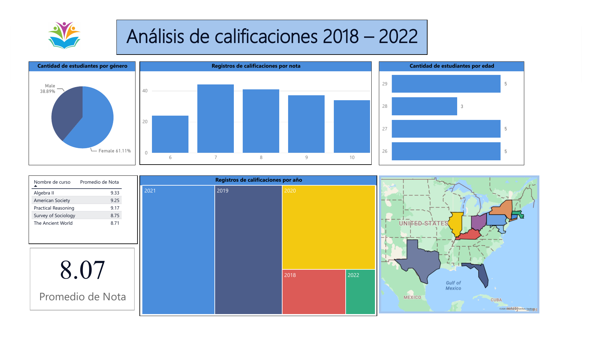
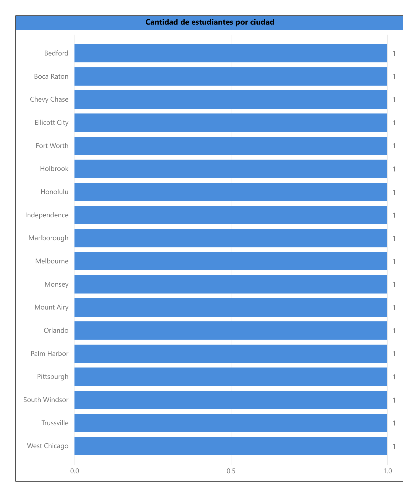

# Análisis de calificaciones 2018–2022 | Power BI

**Autor: Ignacio Cubero**

Proyecto académico de visualización de datos educativos. El informe reúne el promedio de notas, la comparación entre cursos y la distribución de estudiantes por género, edad y ubicación, además de los registros de calificaciones por nota y año.

## Dashboard

## Objetivo

Presentar una visión general de las calificaciones y de las características de la población estudiantil para facilitar su exploración visual.

## Contenido

- Indicador del promedio de nota.
- Tabla de promedios por curso.
- Gráficos de distribución por género, nota y edad.
- Distribución por año mediante un mapa de árbol.
- Mapa geográfico y gráfico de distribución por ciudad.
- Portada con controles de navegación visibles.

## Resultados visibles

| Indicador | Valor mostrado |
|---|---:|
| Promedio de nota | 8.07 |
| Categoría Female | 61.11% |
| Categoría Male | 38.89% |
| Promedio de Algebra II | 9.33 |
| Promedio de American Society | 9.25 |
| Promedio de Practical Reasoning | 9.17 |

Algebra II presenta el mayor promedio entre los cinco cursos visibles en la tabla. Las cifras describen el contexto de la exportación y no permiten establecer causas del rendimiento académico.

## Otras vistas

### Portada

### Distribución por ciudad

## Habilidades reflejadas

- Diseño de informes con varias páginas en Power BI.
- Selección de gráficos para comparar categorías y distribuciones.
- Presentación de indicadores académicos y datos geográficos.

## Archivo editable y mejoras

[Descargar Calificaciones.pbix](Calificaciones.pbix) y abrir con Power BI Desktop.

Se corrigieron las comillas de los títulos y la acentuación de género. Los gráficos por nota y año ahora indican que cuentan registros de calificaciones, evitando confundirlos con estudiantes únicos. La distribución por ciudad utiliza barras horizontales con los nombres completos.

Las imágenes se exportaron desde la versión corregida. Los datos y cálculos originales se conservaron. Los archivos externos de origen no se incluyen; actualizar los datos puede requerir ajustar sus rutas en Power Query.
