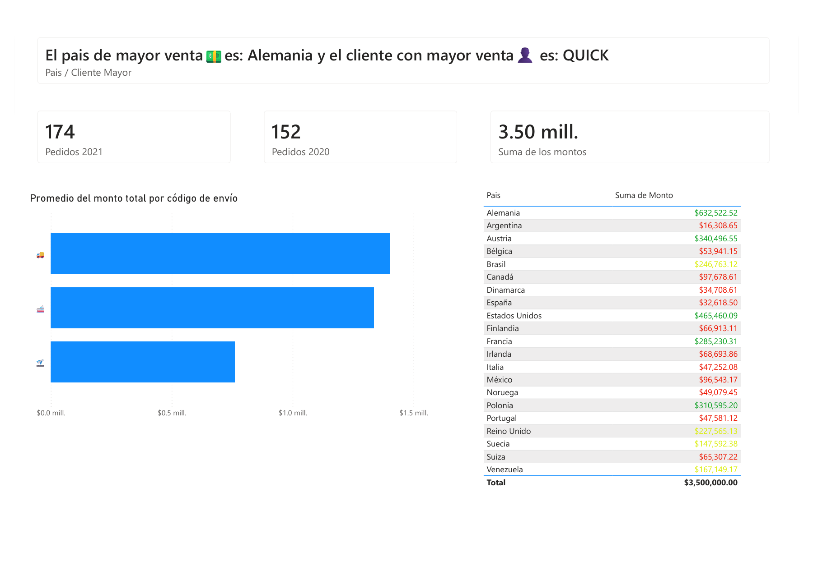

# Análisis de pedidos y ventas internacionales | Power BI

**Autor: Ignacio Cubero**

Proyecto de práctica en Power BI que presenta pedidos de 2020 y 2021, montos por país y una vista por tipo de envío. Incluye un resumen textual del país y del cliente con mayor venta.

## Dashboard



## Objetivo

Facilitar la consulta de indicadores de pedidos e identificar los principales resultados comerciales por país y cliente.

## Contenido

- Tarjetas de pedidos para 2020 y 2021.
- Indicador de suma de montos.
- Tabla de montos por país con colores en los valores.
- Gráfico por tipo de envío con iconos de transporte.
- Resumen textual del país y cliente con mayor venta.

## Resultados visibles

| Indicador | Valor |
|---|---:|
| Pedidos 2020 | 152 |
| Pedidos 2021 | 174 |
| Total de montos mostrado en la tabla | $3,500,000.00 |
| País identificado con mayor venta | Alemania |
| Monto de Alemania | $632,522.52 |
| Cliente identificado con mayor venta | QUICK |

Las tarjetas muestran 22 pedidos más en 2021, equivalentes a un incremento del 14.47%, calculado como `(174 - 152) / 152 × 100`. Este porcentaje se deriva de las tarjetas y no aparece como indicador independiente.

Los resultados corresponden al contexto de la captura. El símbolo monetario se conserva como aparece en el informe; la moneda específica no está identificada.

## Habilidades reflejadas

- Presentación de indicadores comerciales en Power BI.
- Comparación de pedidos entre años.
- Organización de información por país y tipo de envío.
- Uso de resúmenes textuales e indicadores visuales para comunicar resultados.

## Archivo editable y mejoras

[Descargar Pedidos.pbix](Pedidos.pbix) y abrir con Power BI Desktop.

Se amplió la página y la tabla para mostrar los 21 países y el total completo. Se reorganizaron las tarjetas y se aclaró el título del gráfico de envíos. La imagen corresponde al archivo editable actual, cuyo contexto difiere del PDF anterior.

La medida del gráfico promedia los montos totales calculados para cada código de envío presente en el contexto del visual:

```dax
AVERAGEX(
    KEEPFILTERS(VALUES('FormasEnvio'[Código])),
    CALCULATE(SUM('Envios'[Monto]))
)
```

Los datos y las medidas originales se conservaron. Los archivos externos de origen no se incluyen; actualizar los datos puede requerir ajustar las rutas de origen.
